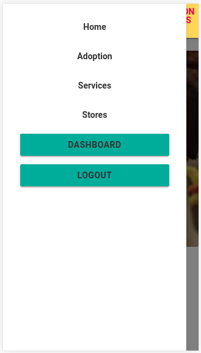
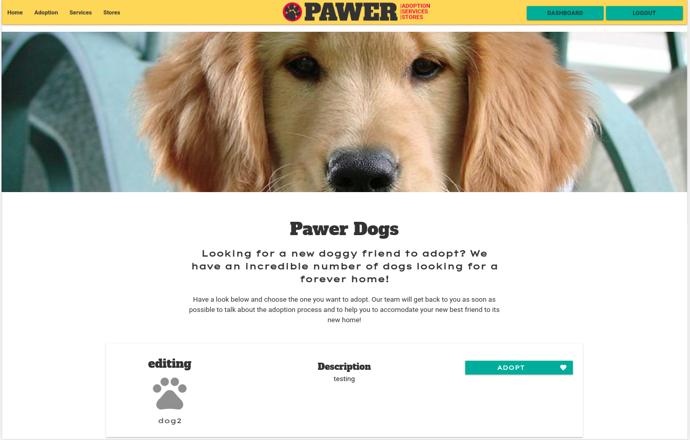
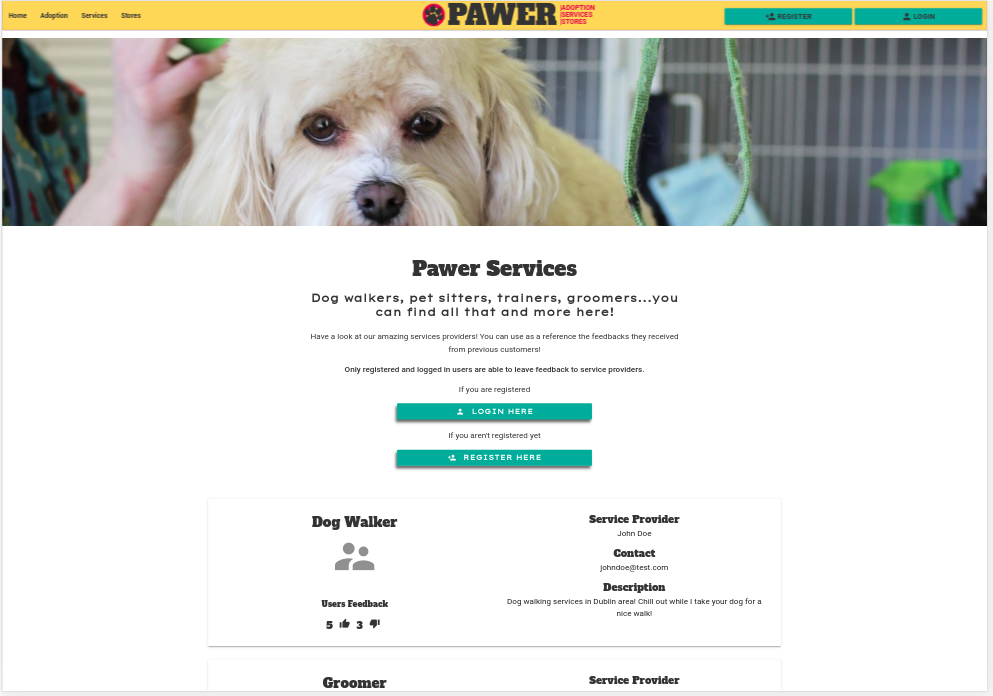
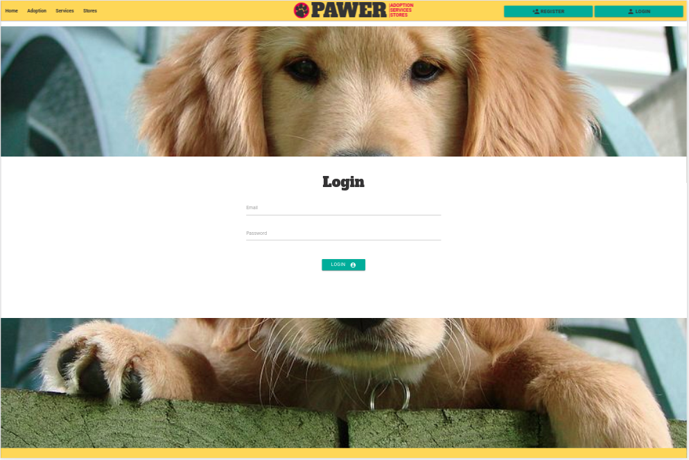
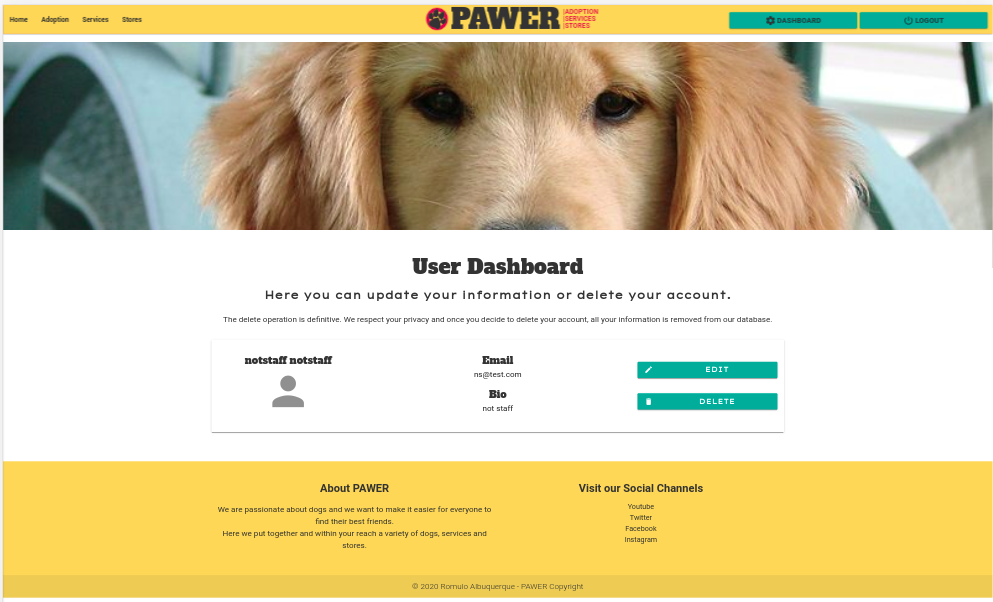
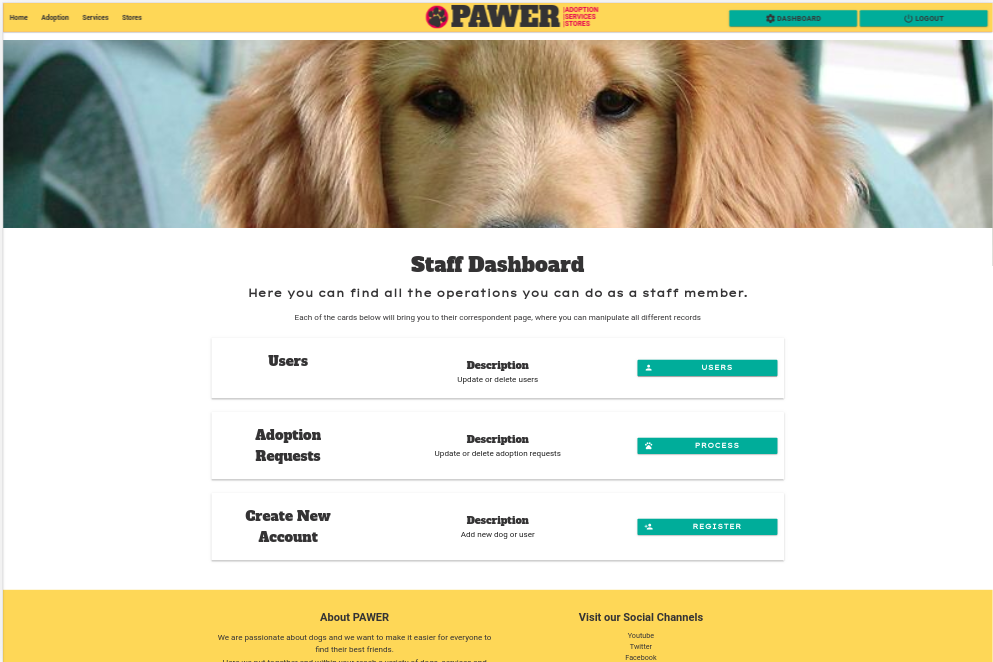
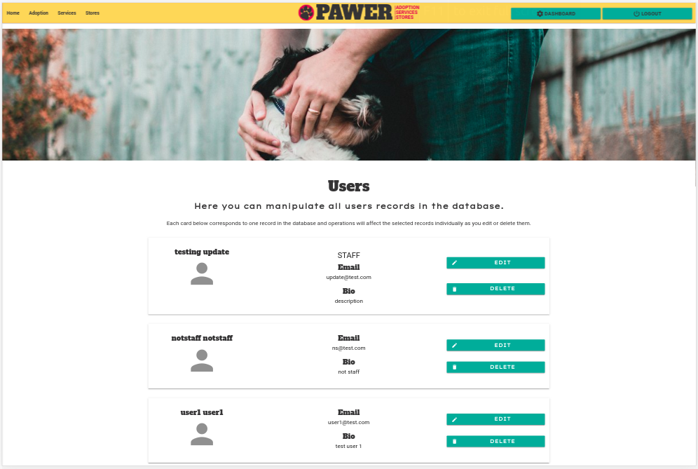
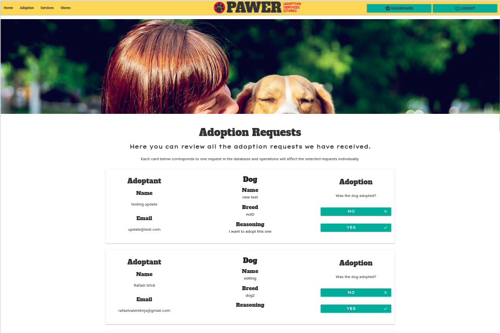
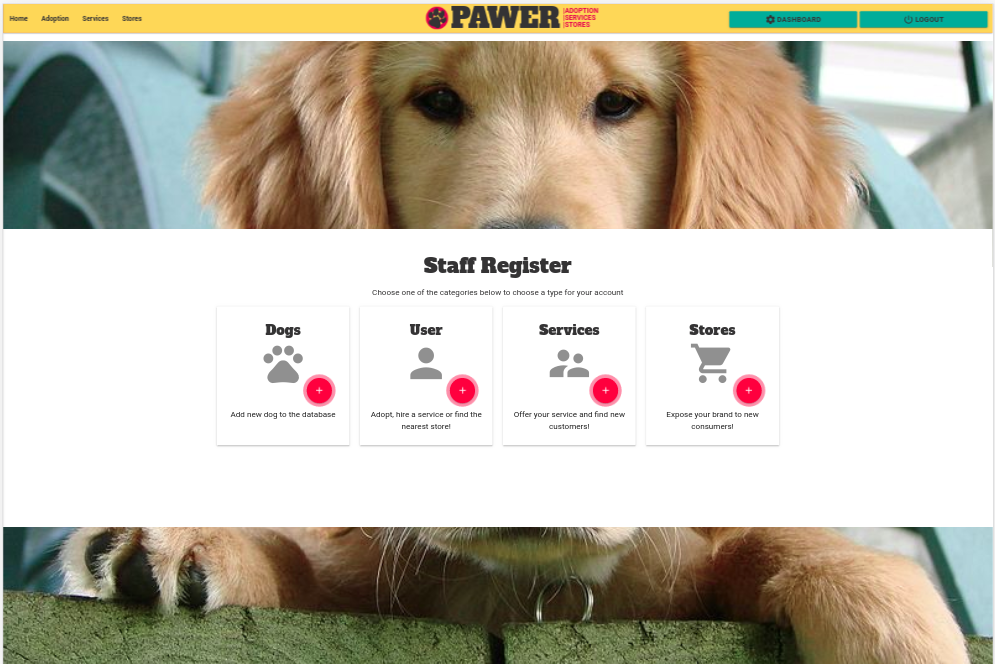

<div align="center">
    
    <a href="https://pawer-db.herokuapp.com/" target="_blank">Pawer - Dog adoption, services and stores.</a>
</div>

## Introduction

<div align="center">
    
</div>
<br>

[Pawer](https://romqrq.github.io/pawer/) is an application that has the proposal to be a platform where users can adopt dogs and business/services can engage new customers.
Users can register and interact with other users information or leaving them feedback on their interaction.
The website has a clean visual while bringing an inviting and friendly feel with an intuitive experience for the user.

As possibilities for monetization for this platform we have implemented discount codes and affiliate links.
Other options such as premium accounts and business/service accounts are also realistic possibilities that can be implemented in the future.

## Table of Contents

1. [UX](#ux)

   - [Goals](#goals)
     - [Customer Goals](#customer-goals)
     - [Service Provider Goals](#service-provider-goals)
     - [Store Goals](#store-goals)
     - [Pawer Goals](#pawer-goals)
   - [User Stories](#user-stories)
     - [Customer Stories](#customer-stories)
     - [Services Stories](#services-stories)
     - [Stores Stories](#stores-stories)
     - [Staff Stories](#staff-stories)
   - [Design Choices](#design-choices)
   - [Wireframes](#wireframes)
   - [Flowchart](#flowchart)

2. [Features](#features)

   - [Existing Features](#existing-features)
     - [Elements common to every Page](#elements-common-to-every-page)
     - [Home Page](#home-page)
     - [Adoption Page](#adoption-page)
     - [Services Page](#services-page)
     - [Stores Page](#stores-page)
     - [Register Page](#register-page)
     - [Login Page](#login-page)
     - [Dashboard](#dashboard-page)
   - [Features Left to Implement](#features-left-to-implement)

3. [Information Architecture](#information-architecture)

   - [Database choice](#database-choice)
   - [Data Storage Types](#data-storage-types)
   - [Collections Data Structure](#collections-data-structure)

     - [Adoption Requests Collection](#dogs-collection)
     - [Dogs Collection](#dogs-collection)
     - [Users Collection](#users-collection)

4) [Technologies Used](#technologies-used)

   - [Tools](#tools)
   - [Libraries](#libraries)
   - [Languages](#languages)

5) [Testing](#testing)

6) [Deployment](#deployment)

   - [Heroku Deployment](#heroku-deployment)
   - [How to run this project locally](#how-to-run-this-project-locally)

7) [Credits](#credits)

   - [Content](#content)
   - [Media](#media)
   - [Code](#code)
   - [Acknowledgements](#acknowledgements)

8) [Contact](#contact)

9) [Disclaimer](#disclaimer)

---

# UX

## Goals

### Customer Goals

The central target audience for us are the potential adoptants such as families and individuals over 18 years old and also people that already have pets and are looking for products or services.

Customer goals are:

- To login or register.
- Finding a dog to adopt.
- Finding pet products or services to buy.
- Finding stores or services nearby.
- Use the application intuitively with minimum of learning.
- Ability to edit and delete my account details.

Pawer helps the customer meeting these goals because:

- The application was developed around those customers' goals from the planning stages of the construction.
- All the navigation is done from the navigation bar menu so the user won't be looking for it.
- Buttons exhibit text and icons that together make the navigation more intuitive.
- Forms where users can interact have explicit field placeholders to guide the user
- Forms that aren't activated by the user are hidden dynamically to avoid cluttering the page.
- Options and features that aren't relevant for customers are omitted according to their account type.

### Service Goals

The pet service sector is getting more diverse by the day.
Our target for services providers are both companies and self employed individuals.

- Expose my service to a mass of potential new customers.
- To have reasonable possibility of return over investment (when services account system is implemented).
- Ability to edit my account details.
- Protection against accidental deletion of my information.

Pawer helps the service providers meeting these goals because:

- Users have access to free accounts that gives them access to a pool of services to choose from.
- Exists the possibility to offer discount codes for services to influence the user decision into hiring the service.
- With affiliate links, it's possible to increase online traffic to the service website.
- Information is prioritized and organized in a way that users can find what is being offered in a glance.
- With the feedback system, great service providers will stand out and set themselves apart, attracting more customers.
- The standardised layout allows similar exposure for all service providers, creating a plain field for competition.

### Store Goals

With more and more customers shopping online, we are aiming for stores are looking to brave this new territory and virtual stores that depend completely on their virtual presence.

- Showcasing my products to a mass of potential new customers.
- Increase physical customer presence at stores (for business with physical stores)
- Reasonable possibility of return over investment (when stores account system is implemented)
- Balanced competition for space between different sizes of business.

Pawer helps the stores meeting these goals because:

- Users have access to free accounts that gives them access to a pool of stores to choose from.
- Exists the possibility to offer discount codes for products to influence the user decision into buying the product.
- With affiliate links, it's possible to increase online traffic to the store website.
- Information is prioritized and organized in a way that users can find what is being offered in a glance.
- With the feedback system, great stores will stand out and set themselves apart, attracting more customers.
- The standardised layout allows similar exposure for all stores, creating a plain field for competition.

### Pawer Goals

The primary goal of Pawer is to create, around the dog adoption process, a meeting point for customers and business/services to meet and improve the adoption experience.
This structure has the objective of making it easier for the adoptant to get things right from the first time and reducing the chances of dogs being abandoned again.

Pawer has four main target audiences: potential dog adoptants, people that already have pets, dog-related service providers and stores.

We are considering the following as potential sources of income are:

- Premium accounts for customers:
  - Discount codes for partner services or stores.
  - Personalized content from partner services or stores
- Affiliate links
- Services and stores accounts:
  - Specific paid accounts for businesses to be showcased on the platform.
- Responsible user data sharing with partners.

## User Stories

### Customer Stories

As a customer I want:

1. The ability to easily navigate through the application with controls that are intuitive and easy to find.
2. Visual feedback for my interactions with the content, so that I know if I have clicked or not clicked something.
3. To be presented concise and objective information displayed in a way that it makes it easier to find what I'm looking for.
4. Be able to register to the website and avail from the discounts on products and services.
5. Be able to update my register information.
6. Find a dog to adopt.
7. Find a service.
8. Find a store.
9. Leave feedback for a service provider.
10. Leave feedback for a store.

### Service Stories

As a service provider I want:

1. To know that my customer can find my information easily
2. The ability to easily navigate through the application with controls that are intuitive and easy to find.
3. Visual feedback for my interactions with the content, so that I know if I have clicked or not clicked something.
4. Be able to register to the website and expose my service to potential customers.
5. Showcase my service on a platform that aggregates value to the service.
6. Be able to update my register information.

### Stores Stories

As a store advertising on Pawer I want:

1. To know that my customer can find my information easily
2. The ability to easily navigate through the application with controls that are intuitive and easy to find.
3. Visual feedback for my interactions with the content, so that I know if I have clicked or not clicked something.
4. Be able to register to the website and expose my store and products to potential customers.
5. Showcase my service on a platform that aggregates value to the service.
6. Be able to update my register information.

## Design Choices

The application is aimed to provide users with a clean, consistent and easy-to-use interface with an engaging and intuitive design. The website was built around the idea that the user will be able to use the website with a minimal learning span and trying to make it achievable upon the first contact.

### Fonts

- The header font `Alfa Slab One` was chosen because it has a professional look and strong character while still highly readable. It is aimed to catch the eye when the user is "sweeping" the screen looking for information.

- The secondary font `Lexend Tera` was chosen to counter balance the header, adding a slim look with more spaced letters. It introduces a more informal visual while still favoring the readability.

- The tertiary font `Roboto` was chosen for the general text, offering a mid-term to the two previous fonts and keeping the page balanced. It is a font with high readability and keeps a clean and professional look.

### Icons

- All icons used were chosen from [materialize library](https://material.io/resources/icons/?style=baseline). They are all icons that have strongly established meaning and are widely used across the internet making them easy to be understood by the users.

- Social media icons for Facebook, Instagram, Twitter and Youtube are used on the footer of the website. These links are targeting the main page of their respective social media network

### Colours

- The colours chosen to the logo were a **mustard-yellow (#FCD23C)**, **black (#343334)** and **red(#D8414B)**. The red and yellow colours have an attention-grabbing propriety as human brain is hardwired to pay attention to these colours for primitive survival reasons. The black colour brings contrast, balance and readability to the logo.

- The buttons are on a **green colour (#26a69a)** which is used only for buttons, the contrast with the main colour scheme makes it grab attention. This way the user has a more consistent and predictable experience.

- The colours were saved as variables on scss file and are recalled from these variables across the styling files to make sure the colours are consistent across the entire project.

### Styling

- The materialize **parallax** class was used to give users a distinct scrolling experience while framing content, helping user to localize the information.

- **Cards** and **buttons** have slightly rounded corners for a more smooth visual and a slight shading for improved perspective perception by the user, helping them to recognize interactive elements on the page.

- Each database entry is displayed on a separate card, making clear to the user the individuality of each entry.

- Repetition of patterns across the whole application provides consistency and helps the user getting familiarized to the application on first time use.

- Hover effect along with color change for active elements have been added to give users visual feedback.

**Backgrounds**

- The elements with the parallax class display pictures that help setting the theme and the feel for each specific section or page.

- Content areas have plain white background to keep it neutral and not to compete for attention with content and pictures.

**Card images**

- Due to technical limitations at this point, the database entries can't contain images. Pertinent Materialize icons were used as a placeholder until future update.

**Forms**

- Materialize forms were used for this project. Placeholders were used to auxiliate the user while identifying each field.

- Forms can take up valuable space on the screen so, for this project, we used jQuery to hide or show forms based on user actions and only one form will be visible at a time.

- When a form is activated, jQuery code will automatically scroll it into view.

**Navigation bar**

- Navigation bar is fixed at the top of the screen. This way the user has the controls always visible and within immediate reach.

- Action buttons/links were kept to the sides for ease of reach on mobile devices.

- Buttons are shown or hidden dynamically on the following situations:

  - user is not logged in or not registered
  - user is logged in but doesn't have staff privileges
  - user is logged in and has staff privileges

- Menu is collapsed to a button when on small resolution screen and expanded when from medium resolution and up.

## Wireframes

These wireframes were created using [Mockflow](https://mockflow.com/) during the Scope Plane part of the design and planning process for this project.

- [Mobile - PDF](wireframes/mobile-wireframe.pdf)
- [Tablet - PDF](wireframes/tablet-wireframe.pdf)
- [Desktop - PDF](wireframes/desktop-wireframe.pdf)

- Notes about the wireframes:
  
    - The **dashboard**, **adoption requests** and **users** pages aren't included as they were introduced at a later stage after reassessment of the progress on the project. The same standard used on the website was adopted for these pages to keep consistency.

    - On mobile, the **Register** and **Login** buttons were removed from the navbar and added to the sidenav due to the reduced space.

    - On mobile, the organizational orientation of the information inside the cards were changed from **horizontal** to **vertical**, giving full width to the main elements inside the cards. 

    - **Register** and **Login** buttons were set to be dinamically replaced by the **Dashboard** and **Logout** buttons according to user's login status.

    - The **register** page on the wireframes was altered and only displays the four cards under staff credentials. For other users only three cards are displayed.

    - We chose to remove the radio buttons from the original plan of the **login** page. It reduces complexity for the user and keeps the page less visually cluttered.

    - All the cards were altered, moving the buttons (where existent) to the extreme right (or bottom on small screen resolution), keeping all information together.

    - For the **services** and **stores** cards, the contact button was replaced by the feedback button. The feedback information was also added to the cards.

### Flowchart

During the planning stages, we created some flowcharts:

This flowchart illustrates the structure of the website, areas users with different privileges can access and actions they can take.

- [Pawer - Website hierarchy and structure](wireframes/flowcharts/pawer-flowchart.jpg)

This flowchart represents the structure of the database and how files are used to generate new documents combining information from existing files and new input from user.

- [Pawer - Database structure](wireframes/flowcharts/database-flowchart.jpg)

On the flowcharts the feedback functionality isn't displayed as it wasn't considered to be feasible under the timeframe set for this project. The feature was added after a reassessment of the progress and the positive impact that the feature could bring to the website.

# Features

## Existing Features

### Elements common to all pages

- Navigation bar
  - The navigation bar is fixed at the top of the screen, always visible and is responsive to screen size.
  - On the left side the menu offers all the navigation options for the user to go from one page to another.
  - On small resolution screens, the menu also contains the Register, Dashboard, Login and Logout buttons, depending on user status (not logged in, logged in non-staff and staff).
  - At the center, the Pawer logo is linked to the index page and it holds an attention grabbing place while leaving the more accessible to touch edges for the menu and buttons.
  - For medium screens and up, the Register, Login and Logout buttons are on the right side and they are shown/hidden dynamically according to user's account status.

**_User not logged in_**

<div align="center">
    <br>
    
</div>

**_User logged in_**

- Despite the dashboard being displayed for all users logged in, staff and non-staff users will be displayed different content on the dashboard page.

<div align="center">
    <br>
    
</div>


- Footer

  - On the left, is displayed a short text about the purpose and mission of the website
  - On the right, a list of the social media links. Currently the links are pointing to the respective home page for that social media platforms.
  - Copyright information.

### Home Page

- Despite the website being fully responsive, there was no need for a different structure on the home page for different devices. The structure is as per image below.

<div align="center">
    
</div>

### Adoption Page

- On this page the user can find a list of the dogs on the database.
- Each dog is displayed on a card that contains:
  - Name
  - Breed
  - A short description of the dog
  - Action button(s).

- For users that aren't logged in, it will be displayed one extra section of content, immediately before the cards, clarifying that the user must be registered and logged in to be able to apply for adoption.
- The **adopt** button is not visible for users under stores or services account types.

<div align="center">
    
</div>

- For non-staff users, the only button available will be "Adopt". This button activates a form that contains a text area for a brief reasoning for the adoption and a submit button.
- The Register and Login buttons above the cards aren't shown anymore after user is logged in.

<div align="center">
    
</div>

- For staff users, the edit and delete buttons will be available and the entry can be edited from there through the dynamic forms activated by the clicked button.

<div align="center">
    
</div>

### Services Page

- This page displays the services registered on the database.
- Each service is displayed on a card that contains:
  - First and last name of the service provider
  - Email
  - Type of service
  - Affiliate links
  - Discount code
  - Amount of discount when using the discount code
  - Address
  - A short text describing the service
  - Positive and negative feedback
  - Action button(s).

- For users that are not logged in, the callout section with the login and register buttons will be displayed and no buttons are displayed on the card.

<div align="center">
    
</div>

- For non-staff users, the only button available will be "Feedback". This button activates a form that contains a radio button element where users can leave a positive or negative feedback and the submit button.
- The Feedback button will be visible but won't activate the form if the user isn't logged in.

<div align="center">
    
</div>

- For staff users, the edit and delete buttons will be available and the entry can be edited from there through the dynamic forms activated by the clicked button.

<div align="center">
    
</div>

### Stores Page

- This page displays the stores registered on the database.
- Each store is displayed on a card that contains:
  - Store name
  - Email
  - Affiliate links
  - Discount code
  - Amount of discount when using the discount code
  - Address
  - A short text describing the store
  - Positive and negative feedback
  - Action button(s).

- For users that are not logged in, the callout section with the login and register buttons will be displayed and no buttons are displayed on the card.

<div align="center">
    
</div>

- For non-staff users, the only button available will be "Feedback". This button activates a form that contains a radio button element where users can leave a positive or negative feedback and the submit button.
- The Feedback button will be visible but won't activate the form if the user isn't logged in.

<div align="center">
    
</div>

- For staff users, the edit and delete buttons will be available and the entry can be edited from there through the dynamic forms activated by the clicked button.

<div align="center">
    
</div>

### Register Page

- This page allows users to create records in the database.
- Staff members are allowed to create 4 types of user accounts:
  - Dogs
  - Users
  - Services
  - Stores
- Other users won't visualize the "Dogs" option.
- On click, each button will activate a different form containing specific information necessary for each entry type:

  - Dogs:
    - Name
    - Breed
    - Short description
  - Users:
    - First name
    - Last name
    - Email
    - Password
    - Client/Staff switch (Visible only for staff users)
    - Bio
  - Services:
    - Service provider first name
    - Service provider last name
    - Email
    - Password
    - Type of service
    - Website
    - Discount code
    - Discount amount
    - Service description
  - Stores:
    - Address
    - Email
    - Website
    - Password
    - Discount code
    - Discount amount
    - Store description

- The submit button is placed just below the fields and the button style follows the standard set for this application.
- The input `type` attributes are set to `text`, `email`, `url` and `number` where appropriate.
- Fields are marked as `requested` except "discount code", "discount amount", and "website".
- The information submitted by the user is submitted through the form and translated to a dictionary before being added as a new document in the database.

### Login Page

- Page where users can input their email address and password to log in.
- A form is centered on the page with two fields: email and password.
- The fields have placeholders that help the user knowing what information we are asking.
- The login button is placed just below the fields and follows the style for buttons throughout the application.
- If the user inputs incorrect data a **message** is displayed informing that the email or password are incorrect.
    - For this feature, we decided to leave it vague as it would make more difficult for someone trying to guess someone else's login details.
- When the user logs in with a correct email and password a **Welcome message** is displayed after the user is redirected to the home page.

<div align="center">
    
</div>

### Dashboard

- The dashboard is a control center and it contains different functionalities depending on the user privileges.
- This page is only accessible through the "Dashboard" button accessible from the collapsible menu or on the navbar, depending on screen resolution.
- The dashboard button replaces the register button once the user is logged in.

**Non-Staff user**

- This page displays a card with the information under the register of the account logged in.
- User can edit the information or delete the account through the dynamic forms.

<div align="center">
    
</div>

**Staff user**

- For staff users, the dashboard gives access to all the information in the database.
- The staff member can access the "Users", "Adoption Requests" and "Register" pages.

<div align="center">
    
</div>

  - **Users page**: Displays all the users on the database individually on cards that contain the "Edit" and "Delete" buttons activating the respective dynamic form. This page is visible only to staff users.

<div align="center">
    
</div>

  - **Adoption Requests page**: Displays a list of cards, each one containing one of the adoption requests in the database. This page is visible only to staff users.
    The staff user can mark the dog as: - Adopted: Deletes the dog and the adoption request records from the database. - Not Adopted: Keeps the dog record and deletes only the adoption record.

<div align="center">
    
</div>

  - **Register page**: Directs the user to the register page where staff can create new dog or user(customer, service or store) entries in the database.
    The staff user can mark the dog as: - Adopted: Deletes the dog and the adoption request records from the database. - Not Adopted: Keeps the dog record and deletes only the adoption record.

<div align="center">
    
</div>

### Permission Denied page

- Pages that are of restricted access have jinja conditional tests that will display a custom permission denied message to the user who attempts to access these pages without the staff privileges.

- The button on this page give the user the option to go back to the home page or use the navbar to go to another page on the website.

## Features Left to Implement

1. Pagination

   - For the presentation of this project, pagination wasn't considered a necessity as the number of registers is very limited.
   - To deal with real world database sizes, the pagination would prevent the users from scrolling for too long and spoiling the overall experience.

2. Filter

   - A filter to help the user to focus on specific categories when searching for dogs, services or stores.

3. More secure login and logout protocol

   - Implementation of a more secure protocol for better protection of users' information.

4. Email authentication

   - Implementation of email authentication of user account before registration is complete.

5. Google maps API

   - Implementation of maps to display stores and services locations on map.
   - Offer a "find near me" function where users can find stores and services based on present location.

6. Promotion Carousel

   - As an extra source of revenue, the carousel could be used to promote products or services.
   - The carousel will replace the image that is displayed on top of every page.

7. Events Section

   - As an opportunity to promote more business and engagement among customers, service providers and stores.
   - This section also opens more opportunities of revenue and brand exposition.

8. Profile images on cards

   - Implementation of functionality where users can upload their profile image or choose from a preset collection.

9. Expiration date for promotional codes

   - Implementation of a field on services and stores cards near the promotional codes displaying an expiration date as a way to create the sense of urgency on users.

10. One feedback per user

    - Creation of an independent collection for the feedbacks containing the id for the store or service that is receiving the feedback, the id of the user who left the feedback, the positive or negative feedback and add a field for a text feedback where the user can write and explain the reasons for the feedback.

11. Replace current form display method for modals

    - The current way the forms are displayed is good but using modals, we will retain more of the user's focus on the task of filling up the forms.

This section will continue to grow as the site is deployed to it's own domain. New issues and needs will be found as we continually reevaluate the application and other can become apparent as the site is used.

# Information Architecture

## Database Choice

As a course requirement, this project is based on a NoSQL database structure. This project was molded to suit better the database characteristics but it could also have been based on a SQL database structure. This project uses the NoSQL MongoDB Database.

### Data Storage Types

The types of data stored in MongoDB for this project are:

- ObjectId
- String
- int32
- Object

### Collections Data Structure

Pawer structure is based on three collections:

#### Adoption Requests Collection

The documents within the adoptRequest collection are a result of the junction of information from the the user (that applied for the adoption) and dog records.

| Title           | Key in db        | Form Validation Type | Data Type |
| --------------- | ---------------- | -------------------- | --------- |
| Request ID      | \_id             | None                 | ObjectId  |
| User First Name | first_name       | text                 | string    |
| User Last Name  | last_name        | text                 | string    |
| Email Address   | email          | email                | string    |
| Password        | password         | password             | string    |
| Bio             | user_description | text                 | string    |
| Staff Status    | is_staff         | text                 | string    |
| Type of user    | usr_type         | text                 | string    |
| User ID         | usr_id           | None                 | ObjectID  |
| Dog ID          | \_id             | None                 | ObjectId  |
| Dog Name        | dog_name         | text                 | string    |
| Dog Breed       | dog_breed        | text                 | string    |
| Dog Description | dog_description  | text                 | string    |

#### Dogs Collection

| Title           | Key in db       | Form Validation Type | Data Type |
| --------------- | --------------- | -------------------- | --------- |
| Dog ID          | \_id            | None                 | ObjectId  |
| Dog Name        | dog_name        | text                 | string    |
| Dog Breed       | dog_breed       | text                 | string    |
| Dog Description | dog_description | text                 | string    |

#### Users Collection

This collection keeps all user types (customer, services and stores) together for this project but on a real world application it could be hard to manage. We consider the use of separate files to be a better choice both for organization and management reasons.

Different user types contain different keys:

-**User**

| Title         | Key in db        | Form Validation Type       | Data Type |
| ------------- | ---------------- | -------------------------- | --------- |
| Account ID    | \_id             | None                       | ObjectId  |
| First Name    | first_name       | text, `maxlength="40"`     | string    |
| Last Name     | last_name        | text, `maxlength="40"`     | string    |
| Email Address | email            | email, `maxlength="40"`    | string    |
| Password      | password         | password, `maxlength="40"` | string    |
| Bio           | user_description | text, `maxlength="400"`    | string    |
| Staff Status  | is_staff         | text                       | string    |
| Type of user  | usr_type         | text                       | string    |

-**Service**

| Title                       | Key in db           | Form Validation Type       | Data Type |
| --------------------------- | ------------------- | -------------------------- | --------- |
| Account ID                  | \_id                | None                       | ObjectId  |
| Service Provider First Name | service_first_name  | text, `maxlength="40"`     | string    |
| Service Provider Last Name  | service_last_name   | text, `maxlength="40"`     | string    |
| Email Address               | email               | email, `maxlength="40"`    | string    |
| Password                    | password            | password, `maxlength="40"` | string    |
| Type of Service             | type_of_service     | text                       | string    |
| Affiliate Link              | aff_link            | text, `maxlength="40"`     | string    |
| Discount Code               | discount_code       | text, `maxlength="40"`     | string    |
| Discount Amount             | discount_amount     | text, `maxlength="40"`     | string    |
| Service Description         | service_description | text, `maxlength="400"`    | string    |
| Staff Status                | is_staff            | text                       | string    |
| Type of user                | usr_type            | text                       | string    |
| Feedback Received           | fb_received         | None                       | object    |
| Positive Feedback           | positive            | integer                    | int32     |
| Negative Feedback           | negative            | integer                    | int32     |

-**Store**

| Title             | Key in db           | Form Validation Type       | Data Type |
| ----------------- | ------------------- | -------------------------- | --------- |
| Account ID        | \_id                | None                       | ObjectId  |
| Store Name        | store_name          | text, `maxlength="40"`     | string    |
| Store Address     | store_address       | text, `maxlength="40"`     | string    |
| Email Address     | email               | email, `maxlength="40"`    | string    |
| Password          | password            | password, `maxlength="40"` | string    |
| Type of Service   | type_of_service     | text, `maxlength="40"`     | string    |
| Affiliate Link    | aff_link            | text, `maxlength="40"`     | string    |
| Discount Code     | discount_code       | text, `maxlength="40"`     | string    |
| Discount Amount   | discount_amount     | text, `maxlength="40"`     | string    |
| Store Description | service_description | text, `maxlength="400"`    | string    |
| Staff Status      | is_staff            | text                       | string    |
| Type of user      | usr_type            | text                       | string    |
| Feedback Received | fb_received         | None                       | object    |
| Positive Feedback | positive            | integer                    | int32     |
| Negative Feedback | negative            | integer                    | int32     |

- The usr_type field is retrieved from the type of form that the user chose during the registration.

- The is_staff value is only changeable by staff accounts and Python uses an if statement to determine if it was activated on the registration/edit forms and attributes a value to the key accordingly.

- The feedback object and its keys/values are set on the registration function to assure the database will store the value will store an integer that can be increased as the users leave their feedback.

# Technologies Used

## Tools

- [Gitpod](https://www.gitpod.io/) is the main IDE used for developing this project.
- [Visual Studio Code](https://code.visualstudio.com/) was also used as IDE for development when Gitpod wasn't available.
- [PIP](https://pip.pypa.io/en/stable/installing/) for installation of tools needed in this project.
- [Git](https://gist.github.com/) to handle version control.
- [MongoDB Atlas](https://www.mongodb.com/cloud/atlas) is the database for this project
- [GitHub](https://github.com/) to store and share all project code remotely.
- [GIMP](https://www.gimp.org/) to edit, crop and save images.
- [PowerMapper](https://www.powermapper.com/) to test functionality on all browsers and devices.
- [Am I Responsive](http://ami.responsivedesign.is/) to create the responsive image when displayed on different devices.
- [Jspell](https://www.jspell.com/) to spell check readme file.
- [visme.co](https://www.my.visme.co) to make the digital version of the flow charts.
- [Compress or die](https://compress-or-die.com/) website used to compress image files.

## Libraries

- [JQuery](https://jquery.com) to simplify DOM manipulation.
- [Materialize](https://materializecss.com/) to provide icons and a consistent and responsive structure to the website.
- [Google Fonts](https://fonts.google.com/) to style the website fonts.
- [PyMongo](https://api.mongodb.com/python/current/) to make communication between Python and MongoDB possible.
- [Flask](https://flask.palletsprojects.com/en/1.0.x/) to construct and render pages.
- [Jinja](http://jinja.pocoo.org/docs/2.10/) to simplify displaying data from the backend of this project smoothly and effectively in html.

## Languages

- [HTML](https://html.com/).
- [CSS](https://developer.mozilla.org/en-US/docs/Web/CSS).
- [JavaScript](https://developer.mozilla.org/en-US/docs/Web/JavaScript).
- [Python](https://www.python.org/).

# Testing

Testing information can be found in separate [TESTING.md](TESTING.md) file

# Deployment

## Heroku Deployment

To deploy Pawer to heroku, take the following steps:

1. Create a `requirements.txt` file using the terminal command `pip freeze > requirements.txt`.

2. Create a `Procfile` with the terminal command `web: python app.py > Procfile`.

3. `git add` and `git commit` the new requirements and Procfile and then `git push` the project to GitHub.

4. Create a new app on the [Heroku website](https://dashboard.heroku.com/apps) by clicking the "New" button in your dashboard. Give it a name and set the region to Europe.

5. From the heroku dashboard of your newly created application, click on "Deploy" > "Deployment method" and select GitHub.

6. Confirm the linking of the heroku app to the correct GitHub repository.

7. In the heroku dashboard for the application, click on "Settings" > "Reveal Config Vars".

8. Set the following config vars:

| Key        | Value                                                                                                              |
| ---------- | ------------------------------------------------------------------------------------------------------------------ |
| DEBUG      | FALSE                                                                                                              |
| IP         | 0.0.0.0                                                                                                            |
| MONGO_URI  | `mongodb+srv://<username>:<password>@<cluster_name>-qtxun.mongodb.net/<database_name>?retryWrites=true&w=majority` |
| PORT       | 5000                                                                                                               |
| SECRET_KEY | `<your_secret_key>`                                                                                                |

- To get you MONGO_URI read the MongoDB Atlas documentation [here](https://docs.atlas.mongodb.com/)

9. In the heroku dashboard, click "Deploy".

10. In the "Manual Deployment" section of this page, made sure the master branch is selected and then click "Deploy Branch".

11. The site is now successfully deployed.

## How to run this project locally

To run this project on your own IDE follow the instructions below:

Ensure you have the following tools:

- An IDE such as [Visual Studio Code](https://code.visualstudio.com/)

The following **must be installed** on your machine:

- [PIP](https://pip.pypa.io/en/stable/installing/)
- [Python 3](https://www.python.org/downloads/)
- [Git](https://gist.github.com/derhuerst/1b15ff4652a867391f03)
- An account at [MongoDB Atlas](https://www.mongodb.com/cloud/atlas) or MongoDB running locally on your machine.
  - How to set up your Mongo Atlas account [here](https://docs.atlas.mongodb.com/).

### Instructions

1. Save a copy of the github repository located at `https://github.com/romqrq/Pawer` by clicking the "download zip" button at the top of the page and extracting the zip file to your chosen folder. If you have Git installed on your system, you can clone the repository with the following command.

```
git clone https://github.com/romqrq/Pawer
```

2. If possible open a terminal session in the unzip folder or cd to the correct location.

3. A virtual environment is recommended for the Python interpreter, I recommend using Pythons built in virtual environment. Enter the command:

```
python -m .venv venv
```

_NOTE: Your Python command may differ, such as python3 or py_

4. Activate the .venv with the command:

```
.venv\Scripts\activate
```

_Again this **command may differ depending on your operating system**, please check the [Python Documentation on virtual environments](https://docs.python.org/3/library/venv.html) for further instructions._

5. If needed, Upgrade pip locally with

```
pip install --upgrade pip.
```

6. Install all required modules with the command

```
pip -r requirements.txt.
```

7. In your local IDE create a file called `.flaskenv`.

8. Inside the .flaskenv file, create a SECRET_KEY variable and a MONGO_URI to link to your own database. Please make sure to call your database `pawer`, with 3 collections called `dogs`, `users` and `adoptRequest`.

9. You can now run the application with the command

```
python app.py
```

10. You can visit the website at `http://127.0.0.1:5000`

# Credits

## Content

- The structure for the readme and testing files was based on my colleague Anna Greaves' files with her consent and the content was significantly changed to reflect the peculiarities of this project and my personal preferences.

## Media

### Images

- The Pawer logo was created using [Canva](https://www.canva.com/).

- [Wikimedia](https://upload.wikimedia.org/)

- [Pexels](https://images.pexels.com/)

- [Pxhere](https://pxhere.com/)

## Code

- For [MongoDB - Atlas](https://www.mongodb.com/), [Flask](https://flask.palletsprojects.com/en/1.1.x/), [Python](https://www.python.org/doc/) and [jQuery](https://api.jquery.com/) the documentation on official websites was constantly used to learn how to use functionalities and avoid deprecated terms and expressions.

- Page components such as buttons, navbar, footer, sidenav and others were taken from [Materialize CSS](https://materializecss.com) and modified to suit the applications needs.

- The code for the parallax feature was taken from [Materialize - Parallax](https://materializecss.com/parallax.html) and edited to fit images better on different screen sizes.

- Code for the pulse effect on buttons was taken from [Materialize - Pulse](https://materializecss.com/pulse.html) and edited to match the style of the application.

## Acknowledgements

I would like to thank my mentor [Simen Daehlin](https://github.com/Eventyret) for pushing me and setting higher standards to push me out of my comfort zone and excel. Simen has also been a great guide as to what is expect from me as a professional, what is expected of my code and my applications.
I would like to thank [Anna Greaves](https://github.com/AJGreaves) for allowing me to use her documentation as a reference to build mine. As a student it is hard to start something when you have no reference and Anna has been a great reference as a successful fellow student.

I also would like to thank my fiance Rebecca Martin for being so patient and supportive when I'm spending endless hours on the computer. All this work is result of our teamwork and her belief on me starting a new career.

# Contact

To contact me feel free to email

`rjaalbuquerque (at) gmail (dot) com`

## Disclaimer

The content of this website is educational purposes only.
